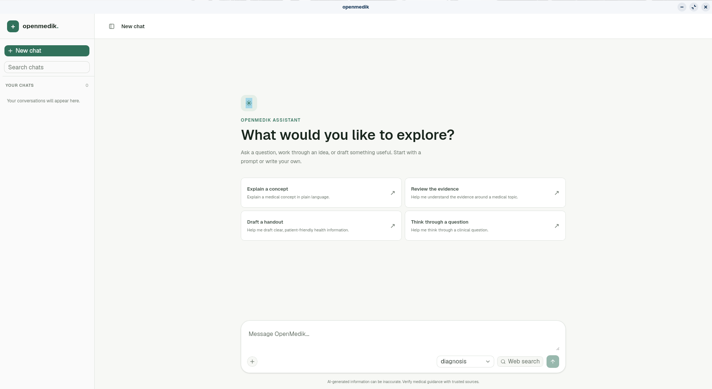

### Introduction

OpenMedik is an open-source platform aimed at aiding healthcare professionals during diagnosis and treatment planning.
It leverages LLM technology to provide accurate and efficient medical insights, enhancing the decision-making process in
clinical settings. The platform is designed to be user-friendly, ensuring that healthcare providers can easily access
and utilize its features.

